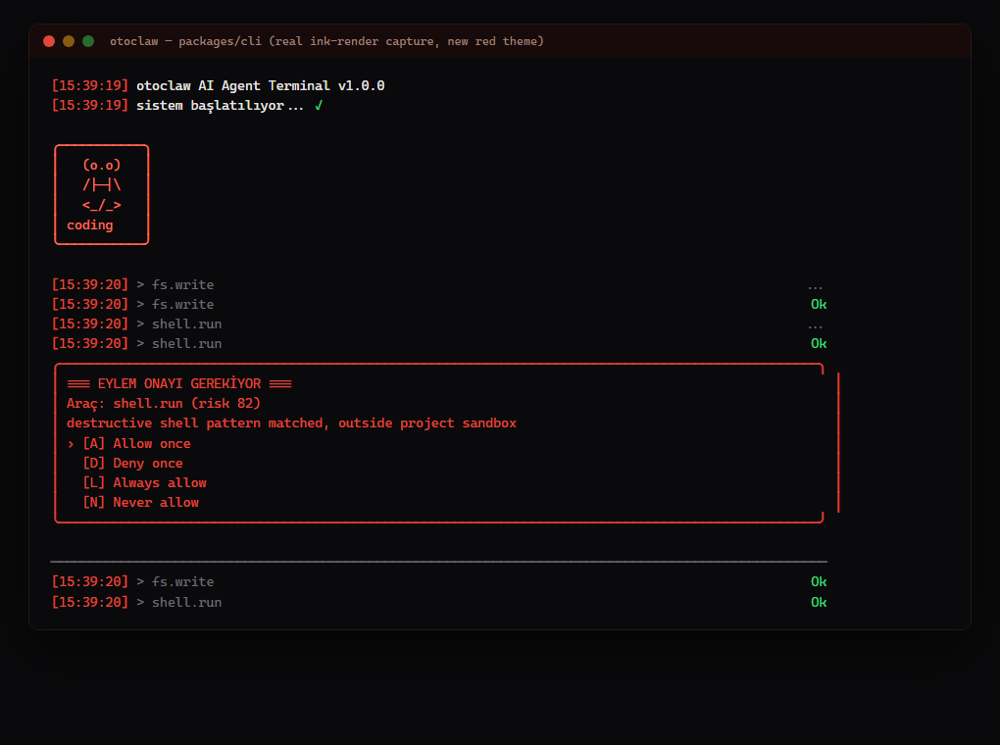
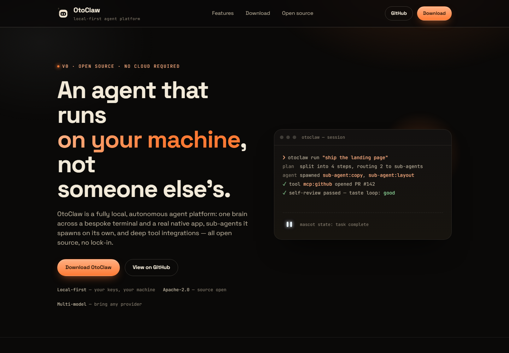

# OtoClaw

**A local-first, open-source, multi-model autonomous agent platform.**

OtoClaw runs on your own machine — a background daemon plus a terminal UI and a
native desktop app — and drives real work end-to-end: it plans, writes and tests
code, spawns sub-agents, calls out to Blender/Unity/GitHub/YouTube, reads a
browser or your screen, and asks you clarifying questions with button prompts
instead of guessing. No cloud service required to run it; secrets stay in your
OS keychain, never in a config file.

Full engineering spec: [`ARCHITECTURE.md`](ARCHITECTURE.md). Project pillars and
roadmap: [`OTOCLAW_PLAN.md`](OTOCLAW_PLAN.md).

## Screenshots

All three below are real, captured pixels from OtoClaw's own code during
development — not mockups. Terminal: the real `App.tsx` rendered headlessly
through Ink's own renderer. Desktop app: a genuine Flutter golden-file
capture of `MascotWidget`. Website: a real headless-Chromium screenshot of
`apps/website`.

| Terminal | Native desktop app | Website |
| --- | --- | --- |
| [](docs/screenshots/terminal.png) | [](docs/screenshots/desktop-app-mascot.png) | [](docs/screenshots/website.png) |

## How OtoClaw compares

The most visible project in this space today is
[**OpenClaw**](https://github.com/openclaw) (formerly Clawdbot/Moltbot) — a
messaging-first, MIT-licensed agent with 68K–196K+ GitHub stars, 50,000+
active users, 10+ chat-platform integrations (WhatsApp, Telegram, Discord,
Slack, Signal, iMessage…), and a 100+ skill marketplace. It has real,
large-scale adoption OtoClaw does not have yet — that's the honest starting
point.

Its own security research is also public and consistent: multiple published
analyses (SMU, NordLayer, Barracuda, IBM X-Force, arXiv papers on OpenClaw
agent security) describe prompt-injection exposure, no reliable way to tell a
legitimate command from an instruction hidden in ingested content, and
excessive default permissions — serious enough that some institutions have
banned it on managed devices.

| | OtoClaw | OpenClaw |
| --- | --- | --- |
| Adoption | New, 0 real users yet | 50,000+ active users, 68K–196K★ |
| Channels | Terminal, native desktop app, browser bridge | 10+ chat platforms (WhatsApp, Telegram, Discord, Slack…) |
| Skill marketplace | 3 bundled design skills, auto-selected per task | 100+ community skills |
| Auto-mode sandbox | **Hard invariant** — `sandboxRequired:true` cannot be disabled via config, enforced and tested in the permission engine | Reported as a known weak point (excessive permissions, prompt injection) in independent security research |
| 3rd-party install | Approval-gated + quarantined before install (skills, MCP servers) | Community skill install, less structural gating reported |
| Sub-agent isolation | Git-worktree isolated, budget/concurrency capped | Not a documented architectural feature |
| License | Apache-2.0 | MIT |

**Where OtoClaw would need to grow to actually compete:** it has zero of
OpenClaw's network effects today. To close that gap it would need (1) chat-
platform bridges — OpenClaw's whole distribution engine — which OtoClaw does
not have at all yet, (2) a real public skill marketplace instead of 3 bundled
skills, (3) actual field usage (real API keys, real users, real incidents to
learn from — this build has none of that yet), and (4) a marketing story that
leads with the one place the research says OpenClaw is genuinely weak:
sandboxing and install-time approval. Security-by-architecture is a real,
defensible angle — but only once there's a userbase large enough for anyone
to compare against.

**Benchmarks:** no live, comparative performance benchmark has been run
against OpenClaw or anything else — that would require a real deployment with
real traffic, which this build has not had. What does exist, honestly: 249
automated tests (0 failing) across 15 workspace packages, each merge
independently re-verified by a separate Tester pass rather than trusting a
single agent's self-report. That's a signal about code correctness, not
about real-world throughput, latency, or user-facing quality — those numbers
don't exist yet and this README won't invent them.

## Pillars

1. **Multi-model brain** — OpenRouter, Anthropic, OpenAI, Google Gemini, NVIDIA
   NIM and local LLMs behind one interface; a "model council" can debate and
   pick the best answer.
2. **Sub-agent orchestration** — the main agent spawns sub-agents that research
   and work in parallel, then merges their results.
3. **Manual & Auto modes** — Manual approves every step; Auto runs freely under
   per-tool permission policies (allow / ask / deny) with sandboxed execution.
4. **Terminal + native app** — a bespoke terminal UI and a real Flutter desktop
   app (no Chromium), with a live animated mascot.
5. **Deep integrations** — Blender, Unity, GitHub, YouTube, and a browser
   extension that operates Gmail/Calendar and tests the sites it builds.
6. **Design-skill-aware coding** — loads a library of design skills so UI work
   comes out polished instead of templated.
7. **Self-extending** — finds, downloads and installs missing skills after
   user approval.
8. **Screen vision** — permission-gated, ephemeral screen reading.
9. **Human-like judgment** — a planning + self-critique "taste loop" on top of
   the coding pipeline.
10. **Button-based questions** — clarifying questions are asked through
    button prompts, not free-text guessing.

## Installation

There is no published release yet — pick the path that matches what you're
doing:

### 1. Monorepo development (recommended today)

```sh
bun install
cp .env.example .env   # fill in your own provider API key(s) + MODEL
bun run dev
```

Provider credentials live in a local `.env` (never committed —
see [`.env.example`](.env.example)): one line per provider, `NAME: value`.
`.env` is checked before the OS keychain, so this is the fastest way to get a
model wired up; the keychain remains the fallback for anyone who prefers it.

This is a [Bun workspaces](https://bun.sh/docs/install/workspaces) monorepo
(`packages/*`, `apps/*`). `bun run dev` starts the daemon
(`@otoclaw/daemon`) in dev mode; drive it from the CLI in `packages/cli`
(`bun run --filter '@otoclaw/cli' start`).

### 2. Install-script binaries

```sh
curl -fsSL https://<release-host>/install.sh | sh   # macOS/Linux
irm https://<release-host>/install.ps1 | iex          # Windows
```

See [`scripts/install.sh`](scripts/install.sh) and
[`scripts/install.ps1`](scripts/install.ps1) — **both currently point at a
placeholder `GITHUB_RELEASES_URL`/`GithubReleasesUrl`** (`OWNER/otoclaw`)
because no GitHub release exists yet. Building the binaries yourself is
possible via `bun run build:binary` ([`scripts/build-binary.ts`](scripts/build-binary.ts)),
which produces `otoclaw`/`otoclaw-daemon` standalone executables under
`packages/cli/dist/`. A Windows installer (Inno Setup) also exists for the
Flutter desktop app — see
[`apps/desktop/installer/windows/README.md`](apps/desktop/installer/windows/README.md).

### 3. npm package (future)

`packages/cli` is shaped as a publishable npm package (`@otoclaw/cli`,
`publishConfig.access: "public"`) but **has not been published yet**. Once it
is, the intended usage is:

```sh
npm i -g otoclaw
```

## Quick start

```sh
bun install
bun run dev          # starts the daemon
```

Then run the CLI against it, or open the desktop app (`apps/desktop`, Flutter).
See [`ARCHITECTURE.md`](ARCHITECTURE.md) §2–§3 for the package layout and the
daemon protocol.

## Documentation

- [`ARCHITECTURE.md`](ARCHITECTURE.md) — package layout, daemon protocol,
  provider layer, agent loop, permission engine, mascot, extension, security.
- [`OTOCLAW_PLAN.md`](OTOCLAW_PLAN.md) — product pillars and phase roadmap.
- [`CONTRIBUTING.md`](CONTRIBUTING.md) — how to develop, test, and submit changes.
- [`SECURITY.md`](SECURITY.md) — security model and how to report a vulnerability.

## Project status

Phases 0–6 of the v1 roadmap are complete: daemon + protocol, provider layer,
terminal UI and native app, browser extension + vision, integrations
(Blender/Unity/GitHub/YouTube/Google), and packaging (landing page, installers,
plugin registry, this documentation). Test suite, typecheck and lint are green
across the workspace.

Honest caveat: this has been built and unit/integration-tested throughout, but
**no end-to-end run against real API keys / a real user session has been done
yet**. Treat v1 as feature-complete but not yet field-validated.

## License

Apache License 2.0 — see [`LICENSE`](LICENSE).
